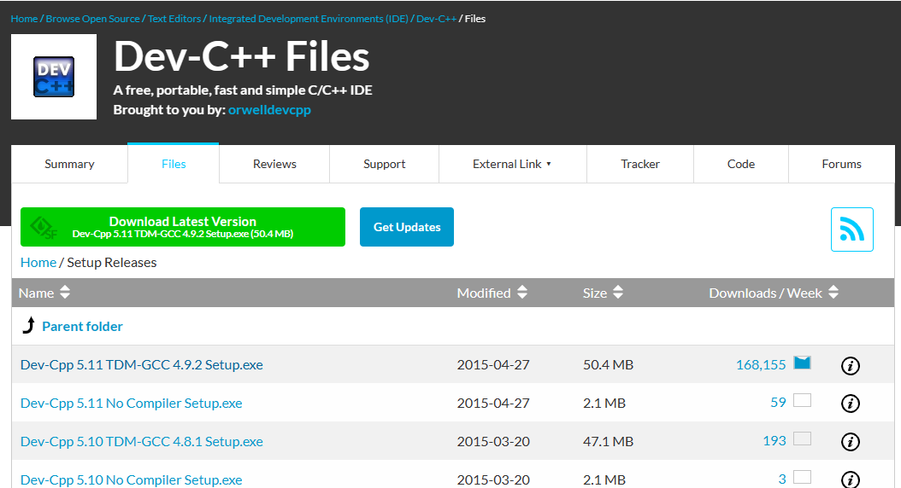

### 在计算机编程学习之前，让我们首先了解一下操作系统以及使用的编程工具。操作系统是计算机中的“接待大厅”，它管理计算机的所有硬件和软件，是我们与计### 算机互动的关键。我们将介绍操作系统的基本概念，并学习使用一款常见的 C++代码编辑工具——DEV-C++。

# 什么是操作系统？
### 操作系统是什么？ 操作系统就像计算机的大管家，它管理和协调计算机的各个部分，包括硬件和软件。它使计算机能够执行各种任务，如浏览网页、处理文件、### 识别输入设备（如键盘和鼠标）等。
# 常见的操作系统
### Windows 10： Windows 10 是微软公司的操作系统，广泛用于个人电脑和商用计算机。

### MacOS： MacOS 是苹果公司的操作系统，设计用于苹果的 Macintosh 电脑。

### Ubuntu： Ubuntu 是一个基于 Linux 的操作系统，适用于桌面和服务器应用。

### NOI Linux： 如果你计划参加中国计算机学会主办的全国青少年信息学奥林匹克竞赛（NOI），你可能需要熟悉 NOI Linux 操作系统，它类似于 Ubuntu。

### #DEV-C++的安装和使用
### 什么是 DEV-C++？ DEV-C++是一款用于编写 C++程序的集成开发环境（IDE），它在 Windows 系统上广泛使用。它是 NOI 科学委员会推荐的 C++编程练习工具。

### 如何安装 DEV-C++？ 您可以从https://sourceforge.net/ (opens new window)下载 DEV-C++。安装过程中，请选择适合您的选项，如语言和安装目录。参考示例 ✨

### 创建和运行程序： 打开 DEV-C++后，您可以创建新程序并保存它。然后，使用“编译运行”命令来编译和运行您的程序。这将在终端窗口中显示程序的输出。

### 示例程序： 以下是一个简单的示例程序，它将显示“Hello, World!”：

### #include <iostream>
### using namespace std;
### int main() {
###     cout << "Hello, World!" << endl;
###     return 0;
### }
### 这是一个简单的 C++程序，通过 DEV-C++您可以创建、编辑和运行类似的程序。

### 现在，您已经了解了操作系统和如何使用 DEV-C++这一编程工具。在学习 C++编程之前，确保您已经安装了适当的开发环境，并准备好开始编写代码。愿您在编程之旅中取得成功！

### 小练习 请按照 0.4 节中的要求，准备好编程所需要的所有工具，然后新建一个 C++ 程序，并且输入如下的内容：保存然后编译运行这个程序，看看会输出什么。

### #include <iostream>
### using namespace std;
### int main() {
###     cout << "恭喜你" << "安装成功啦！" << endl;
###     return 0;
### }
# 参考示例

### 1 2 3 4 5 6 7 8 9 10 11 12 13 14
# ide 程序多主程序时报错
### 解决办法: 独立编译

### 同一个项目中创建多个不同的 .cpp 文件，每个文件可以包含一个独立的 C++ 程序，并在每个程序中拥有一个单独的 main() 函数。然后，你可以分别编译这些文件，以便在同一个项目中管理多个程序。 在 Dev-C++ 中，你可以通过以下步骤来创建多个 .cpp 文件并分开运行它们：

### 打开 Dev-C++ 并创建一个新的项目或打开一个现有项目。

### 在项目中选择 "New Source File"（新建源文件）。这将创建一个新的 .cpp 文件。

### 在新创建的 .cpp 文件中编写你的 C++ 程序，包括一个 main() 函数。

### 重复上述步骤，为每个要分开运行的程序创建一个新的 .cpp 文件。

### 在项目中编译和运行你的程序时，你可以选择要运行的源文件，以便执行特定的程序。这通常可以在 IDE 的菜单或工具栏中找到，或者你可以通过右键单击源文件并选择 "Compile & Run"（编译并运行）来执行特定的程序。

### 这样，你可以在同一个项目中管理多个独立的 C++ 程序，每个程序都有自己的 main() 函数。你可以选择运行这些程序中的任何一个，而不必担心冲突的 main() 函数。